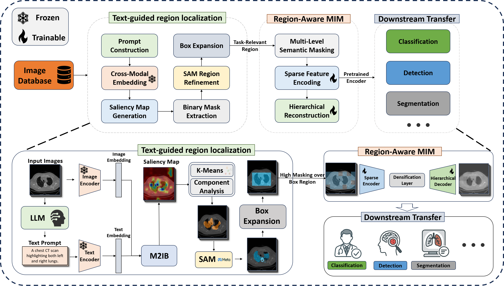

# MWM: Mask What Matters — Text-Guided Masking for Self-Supervised Medical Imaging （PromptMask）

MWM is a text-guided self-supervised learning framework for medical imaging. It performs prompt-based region localization and applies controllable, differentiated masking to align representation learning with diagnostically relevant regions.

---

## Project Intro

- Authors: Ruilang Wang, Shuotong Xu, Bowen Liu, Runlin Huang, Donglong Chen, Weifeng Su
- Affiliation: Beijing Normal–Hong Kong Baptist University
- Paper: https://arxiv.org/abs/2509.23054

**TL;DR**
- Prompt-based localization + controllable masking (salient vs. background)
- Lower overall mask ratios (e.g., 40% vs 70%) with stronger representations
- Consistent gains over random masking and SparK across MRI/CT/X-ray

**Figures**
- Framework: 
- Mask Visualization (ours vs. random): [assets/figures/mask_vis.pdf](assets/figures/mask_vis.pdf)
- Localization Visualization: [assets/figures/loc_vis.pdf](assets/figures/loc_vis.pdf)

**Abstract (short)**
We introduce a controllable, text-guided masking framework for self-supervised medical image analysis. Using vision–language models for prompt-based localization, MWM emphasizes diagnostically relevant regions and reduces background redundancy, improving semantic alignment and generalization. Across MRI, CT, and X-ray, MWM outperforms random masking and SparK with lower mask ratios (e.g., +3.1 Acc, +1.3 BoxAP, +1.1 MaskAP).

---

## Code Guide

**Structure**
- `pretrain/` — region-aware masked pretraining
- `text2region/` — localization (saliency, postprocessing, evaluation)
- `downstream_imagenet/` — classification
- `downstream_d2/` — detection/segmentation via Detectron2

**Setup**
- `conda create -n mwm python=3.8 -y && conda activate mwm`
- `pip install -r requirements.txt`
- Install PyTorch matching your CUDA/CPU: https://pytorch.org/get-started/locally/

**Data**
- Saliency inputs: `/path/to/images/*.png|*.jpg`
- Optional val set: `/path/to/val_images/*.png|*.jpg`
- ImageNet-style: `/path/to/imagenet/{train,val}/class_x/*.jpeg`

**Text→Region**
- Generate saliency (BiomedCLIP):
  - `python text2region/saliency_maps/generate_saliency_maps.py --input-path /path/to/images --output-path saliency_map_outputs/sample/masks --model-name BiomedCLIP --val-path /path/to/val_images --hyper-opt`
  - Use interactive prompt, or `--reproduce --json-path mapping.json` for per-image text
- Postprocess (thresholding):
  - `python text2region/postprocessing/postprocess_saliency_maps.py --postprocess thresholding --sal-path saliency_map_outputs/sample/masks --output-path coarse_outputs/sample/masks --threshold 0.3 --filter --num-contours 2 --generate-expanded --expanded-output-path expanded_masks/coarse/sample/masks --expand-ratio 1.0`
- Postprocess (CRF):
  - `python text2region/postprocessing/postprocess_saliency_maps.py --postprocess crf --input-path /path/to/images --sal-path saliency_map_outputs/sample/masks --output-path coarse_outputs/sample/masks --m 2 --tau 1.0 --epsilon 1e-6 --gaussian-sxy 3 --bilateral-sxy 50 --bilateral-srgb 5`
- Optional SAM refinement: see `text2region/zeroshot.sh` (external repo/checkpoint)

**Pretraining**
- `python pretrain/run_targeted_masking.py`

**Downstream**
- Classification: `python downstream_imagenet/main.py --data /path/to/imagenet --epochs 100 --batch-size 256`
- Detection/Segmentation: `python downstream_d2/train_net.py --config-file configs/ct_tumor.yaml --opts MODEL.WEIGHTS /path/to/pretrained_model.pth`

**Notes**
- `text2region/evaluation/eval.py` gracefully degrades if `SurfaceDice` is missing (DSC only)
- On Windows, run the Python commands above; `zeroshot.sh` is a bash helper only

**Citation**
```
@article{wang2025mwm,
  title   = {Mask What Matters: Controllable Text-Guided Masking for Self-Supervised Medical Image Analysis},
  author  = {Ruilang Wang and Shuotong Xu and Bowen Liu and Runlin Huang and Donglong Chen and Weifeng Su},
  journal = {arXiv preprint arXiv:2509.23054},
  year    = {2025}
}
```
